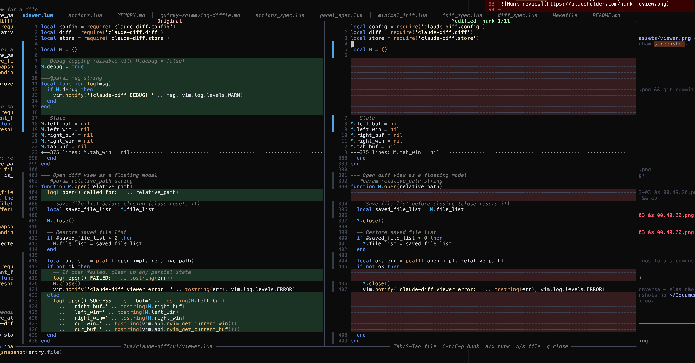
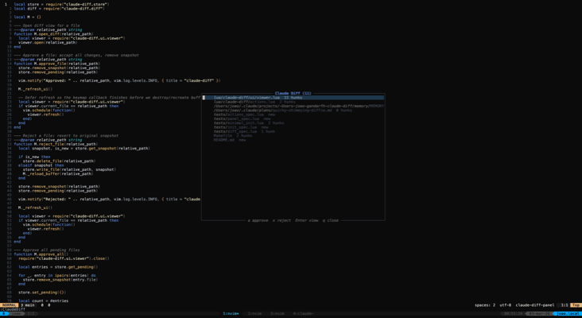

# claude-diff.nvim

A Neovim plugin that intercepts Claude Code file edits via hooks and lets you review, approve, or reject each change — file by file, hunk by hunk — with a side-by-side diff viewer.

<a href="./assets/viewer.png">
  
</a>

## How it works

1. **Claude Code hooks** snapshot every file *before* Claude edits it
2. **Panel** lists all pending changes with status icons
3. **Viewer** shows a side-by-side diff (old vs new) in floating windows
4. **You decide** — approve or reject at the file or hunk level

## Requirements

- Neovim >= 0.9
- [jq](https://jqlang.github.io/jq/) (for hook scripts)
- [Claude Code CLI](https://docs.anthropic.com/en/docs/claude-code)

## Installation

### 1. Install the plugin

**lazy.nvim**

```lua
{
  'gandarfh/claude-diff',
  config = function()
    require('claude-diff').setup()
  end,
}
```

### 2. Install the hooks

```bash
# Clone and install
git clone https://github.com/gandarfh/claude-diff.git
cd claude-diff
./install.sh

# To uninstall hooks later
./install.sh --uninstall
```

This registers `PreToolUse` and `PostToolUse` hooks in `~/.claude/settings.json` that capture file snapshots whenever Claude uses `Edit` or `Write` tools.

## Usage

### Commands

| Command | Description |
|---|---|
| `:ClaudeDiff` | Toggle the review panel |
| `:ClaudeDiffOpen` | Open the review panel |
| `:ClaudeDiffClose` | Close all UI |
| `:ClaudeDiffRefresh` | Refresh the file list |
| `:ClaudeDiffApproveAll` | Approve all pending changes |
| `:ClaudeDiffRejectAll` | Reject all pending changes |

### Panel keymaps

<a href="./assets/panel.png">
  
</a>

| Key | Action |
|---|---|
| `<CR>` | Open diff viewer for selected file |
| `a` | Approve selected file |
| `x` | Reject selected file (revert to original) |
| `A` | Approve all files |
| `X` | Reject all files |
| `r` | Refresh file list |
| `q` / `<Esc>` | Close panel |

### Viewer keymaps

<a href="./assets/viewer.png">
  
</a>

| Key | Action |
|---|---|
| `a` | Approve current hunk |
| `x` | Reject current hunk |
| `A` | Approve current file |
| `X` | Reject current file |
| `<C-n>` | Next hunk |
| `<C-p>` | Previous hunk |
| `<Tab>` | Next file |
| `<S-Tab>` | Previous file |
| `q` / `<Esc>` | Close viewer |

## Configuration

```lua
require('claude-diff').setup({
  storage_dir = '.claude-diff',  -- where snapshots are stored
  panel_width = 35,              -- panel width in columns
  auto_refresh = true,           -- auto-refresh on file changes
  icons = {
    modified = '●',
    new_file = '+',
    approved = '✓',
  },
  keymaps = {
    open = '<leader>cd',         -- open the panel
    approve_file = 'a',
    reject_file = 'x',
    approve_all = 'A',
    reject_all = 'X',
    refresh = 'r',
    close = 'q',
    open_diff = '<CR>',
    next_hunk = '<C-n>',
    prev_hunk = '<C-p>',
    approve_hunk = '<leader>ha',
    reject_hunk = '<leader>hx',
  },
})
```

## Running tests

```bash
make test          # all tests (107)
make test-diff     # diff module
make test-store    # store module
make test-viewer   # viewer module
make test-panel    # panel module
make test-actions  # actions module
make test-init     # init module
```

Requires [plenary.nvim](https://github.com/nvim-lua/plenary.nvim) in `~/.local/share/nvim/lazy/plenary.nvim`.

## License

MIT
